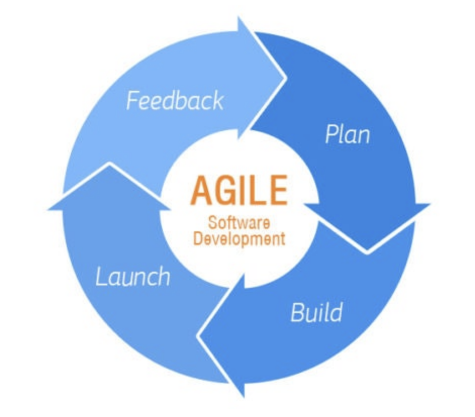
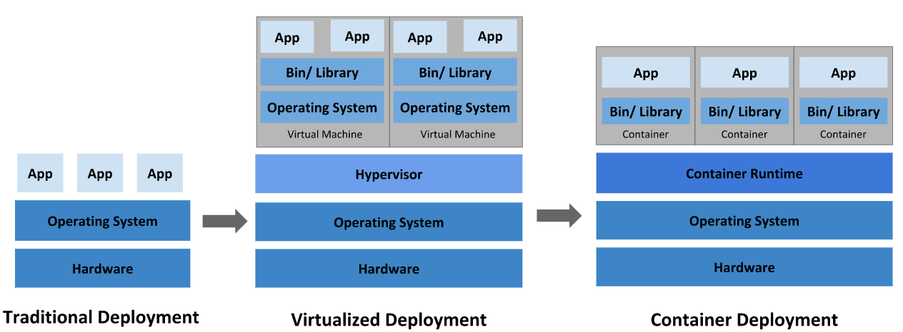

# Server

# DevOps = Development + Operations

### 핵심 아이디어:

- **자동화**: 테스트, 빌드, 배포 모두 자동화
- **협업**: 개발자와 운영자가 함께 일함
- **지속적 개선**: 반복하고 개선하는 사이클

### 🔧예시 도구:

- Docker, Kubernetes
- Git, Jenkins, GitHub Actions
- Terraform, Ansible

## Agile:



> Agile is a software development methodology focused on flexibility, collaboration, and delivering working software in small iterations.
> 

**핵심 특징:**

- 작고 빠른 배포 (주 단위 스프린트)
- 지속적인 피드백
- 변화에 유연하게 대응

**대표 프레임워크:**

- Scrum, Kanban, XP (Extreme Programming)

## CI/CD

**CI (Continuous Integration)**

- 개발 초기부터 실행이 가능한 상태로 코드를 유지하는 것
- 코드가 변경될 때마다 자동으로 빌드하고 테스트
- 코드 병합을 안전하게

**CD (Continuous Delivery / Deployment)**

- Delivery: 배포 준비까지 자동화 (but 수동 승인)
- Deployment: 실제 배포까지 자동화

대표 프레임워크:

- GitHub Actions, Jenkins

---

# History of Deployment



## **Traditional Deployment**

- Each application runs **directly on the host OS**.
    
    ## Host OS vs Guest OS 차이
    
    | 항목 | Host OS | Guest OS |
    | --- | --- | --- |
    | 설치 위치 | 실제 컴퓨터에 직접 설치 | 가상 머신이나 컨테이너 내부에 설치 |
    | 역할 | 전체 시스템과 하드웨어를 관리 | 하이퍼바이저나 컨테이너 안에서 실행됨 |
    | 예시 | Windows, macOS, Ubuntu | Ubuntu, CentOS, Kali 등 |
- Applications can **conflict with each other** due to shared libraries, dependencies, or resources.

## Virtualized Deployment

- Each application runs in a **separate virtual machine (VM)**.
- **Hypervisor** manages these VMs on top of a **host OS**.
- Each VM includes its **own OS**, so they’re **fully isolated**.
- 가상머신은 완전한 컴퓨터이고 가상머신에 **일일이 운영체제를 설치**해야 하기 때문에 **Container Deployment**보다는 **무거운** 편
- Virt**tualized Deployment 방식의 IaaS(Infrastructure as a Service) 서비스 → AWS EC2**
    
    ## 비교 표
    
    | 항목 | IaaS | PaaS | SaaS |
    | --- | --- | --- | --- |
    | 대상 | 인프라 (서버, 네트워크) | 실행 환경 (서버 + 미들웨어) | 소프트웨어 전체 |
    | 관리 범위 | 사용자가 대부분 직접 | 클라우드가 서버 관리 | 클라우드가 전부 관리 |
    | 사용자 역할 | OS 설치, 앱 배포 직접 | 코드만 작성 | 그냥 사용 |
    | 예시 | AWS EC2, GCP Compute | AWS Beanstalk, Heroku | Gmail, Zoom, Notion |
    
    ## 한눈에 보기: 피자 비유
    
    | 방식 | 설명 | 내가 하는 일 |
    | --- | --- | --- |
    | 🧱 IaaS | **피자 재료만 제공** | 반죽 만들기부터 피자 다 만듦 |
    | 🍕 PaaS | **반죽 + 오븐 + 재료 제공** | 토핑하고 굽기만 하면 됨 |
    | 📦 SaaS | **완성된 피자 배달됨** | 먹기만 하면 됨 |

### **Hypervisor:**

A **Hypervisor** is a type of **software or firmware** that allows you to **create and run multiple virtual machines (VMs)** on a single physical computer.

Type 1: **Bare-metal Hypervisor (하드웨어 직접 설치형)**

- Runs **directly on the physical hardware**
- No host operating system is required
- Used mainly in **servers and data centers**
- VMware ESXi, Microsoft Hyper-V (server version), Xen

Type 2: **Hosted Hypervisor (운영체제 위 설치형)**

- Runs **on top of an existing operating system**
- Easier to install and good for **developers and testers**
- VirtualBox, VMware Workstation, Parallels Desktop (macOS)

## **Container Deployment**

Hypervisor → Container Runtime, VM → Container

Container: A **container** is a **lightweight, portable, and isolated environment** that packages an application and everything it needs to run (code, libraries, settings) — **but without including an entire operating system**.

Container Runtime: 컨테이너를 다루는 도구 (도커)

orchestration: 여러 서버에 걸친 컨테이너 및 사용하는 환경 설정을 관리하는 행위

Kubernetes(k8s): 컨테이너 런타임을 통해 컨테이너를 오케스트레이션 하는 도구

---

# Application Deployment Architecture

| 이름 (역할/계층) | 설명 | 구체적인 도구 (예시) |
| --- | --- | --- |
| **소스 코드 관리 계층 (Source Control)** | 코드 작성, 협업, 버전 관리 | GitHub |
| **CI/CD 계층 (Automation Pipeline)** | 빌드, 테스트, 배포 자동화 | GitHub Actions, Jenkins |
| **애플리케이션 실행 환경 (App Runtime / 컨테이너화)** | 앱을 실행 가능한 형태로 포장 | Docker, Gunicorn, 앱 코드 |
| **컨테이너 오케스트레이션 계층 (Orchestration Layer)** | 컨테이너를 클러스터에 배포/관리 | Kubernetes |
| **인그레스 / 트래픽 라우팅 계층 (Ingress / Routing Layer)** | 외부 요청을 내부 서비스로 전달 | nginx, Traefik, HAProxy |
| **인프라 계층 (Cloud Infrastructure)** | VM, 네트워크, 스토리지 등 물리 자원 | AWS, GCP, Azure |

---

```
최초의 웹 서버는1995년 UNIX 기반으로 만들어진 NCSA Httpd 였다.
하지만 처음은 다 그렇듯이 NCSA Httpd에는 버그가 상당히 많아서 개발자들이 사용할 때 많은 불편함을 겪었다고 한다.
그래서 이러한 문제를 해결하기 위해 구조도 변경하고 새로운 기능을 추가해 개발된 것이 바로 Apache이다.
```

[https://hstory0208.tistory.com/entry/Nginx란-무엇이고-왜-사용하는가-Apache와-차이점](https://hstory0208.tistory.com/entry/Nginx%EB%9E%80-%EB%AC%B4%EC%97%87%EC%9D%B4%EA%B3%A0-%EC%99%9C-%EC%82%AC%EC%9A%A9%ED%95%98%EB%8A%94%EA%B0%80-Apache%EC%99%80-%EC%B0%A8%EC%9D%B4%EC%A0%90)

```
브라우저 → nginx(Web Server) → Gunicorn(WAS) → Django 앱 → DB
```

## nginx

고성능 웹 서버이자 리버스 프록시 서버, 로드 밸런서, 캐시 서버로 사용되는 서버용 애플리케이션

Web Server, Reverse Proxy, Load Balancer

**Gunicorn**

파의썬의 WSGI(Web Server Gateway interface)를 구현하는 HTTP server

**CGI [Common Gateway Interface]**

## Reverse Proxy

외부에서 들어오는 요청을 받아서, **내부의 실제 서버로 대신 전달해주는 중간 서버**

Load Balancer

**같은 기능을 하는 서버 여러 개**가 있을 때, **트래픽을 골고루 나누는 장치**입니다.

 TLS/SSL 설정

**HTTP를 안전하게 만드는 보안 기술**

**HTTPS = HTTP + SSL/TLS**

TLS vs SSL

**SSL**은 예전 명칭, **TLS**는 현재 표준화된 버전 (더 안전함)

---