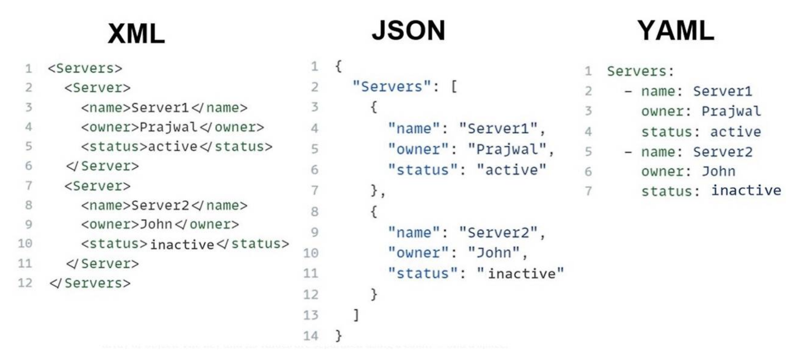

# Docker

### `docker build -t pragmatic-final .`

Dockerfile 을 참고해서 pragmatic-final 이라는 이미지를 만듬

```docker
FROM python:3.9.0

WORKDIR /home/

RUN echo "test"

RUN git clone https://github.com/yoon-woong-gi/Madison_Pin_Board.git

WORKDIR /home/Madison_Pin_Board/

RUN pip install -r requirements.txt

RUN pip install gunicorn

RUN pip install mysqlclient

RUN echo "SECRET_KEY=django-insecure-1^5r-wn&ffhit&e@cjbwgt#3z71b3fvtrlw#g9%h07a4$%hmet" > .env

RUN python manage.py migrate

RUN python manage.py collectstatic

EXPOSE 8000

CMD ["gunicorn", "pragment.wsgi", "--bind", "0.0.0.0:8000"]
```

- RUN echo "test" 있는 이유
    
    Docker는 각 명령어 단위로 결과를 저장해두고, 다음에 동일한 명령어를 만나면 저장된 결과를 재사용(=캐시)**해서 빨리 빌드함
    
    그래서 만약 requirements.txt 가 바뀌었는데 Docker가 캐시를 써서 RUN pip install을 **스킵** 해버리면, 패키지가 반영되지 않음.
    
    그래서 `RUN echo "test"` 이런 식으로 **의도적으로 캐시를 깨버리면**, 그 이후 단계는 무조건 새로 실행됩니다.
    

### `docker run -p 8000:8000 mad`

Docker 컨테이너는 기본적으로 "외부에서 접근이 차단된 별도 공간"이라서, 

내가 직접 "포트를 열어서 연결해줘야" 외부(브라우저)에서 접속할 수 있습니다.

→ CSS 같은 정적인 파일들 연결이 되지 않아서 추가적인 작업이 필요

# nginx

Django 앞에서 요청을 받아서 적절히 분배하고, 보안·속도·정적 파일 처리 등을 전담하는 "웹 서버”

| 역할 | 설명 |
| --- | --- |
| **Reverse Proxy** | 외부 요청을 받아 Django(Gunicorn)로 전달 |
| **정적 파일 처리** | `/static/`, `/media/` 같은 파일을 빠르게 처리 (Django보다 훨씬 효율적) |
|  **보안 / HTTPS** | SSL 인증서 설정 가능 (Let's Encrypt, TLS 등) |
| **부하 분산(Load Balancing)** | 다수의 Django 인스턴스에 트래픽 분산 가능 |
| **요청 필터링** | IP 차단, 경량 캐싱, 압축 등 다양한 필터 가능 |

`nginx.conf`

```
worker_processes auto;

events{
}

  http {
      server {
        listen 80;

        include mime.types;

        location /static/ {
            alias /data/static/;
        }
        location /media/ {
            alias /data/media/;
        }
        location / {
            proxy_pass http://django_container_gunicorn:8000;
            proxy_set_header Host $host;
            proxy_set_header X-Forwarded-For $proxy_add_x_forwarded_for;
        }
      }
  }
```

| 항목 | 설명 |
| --- | --- |
| `worker_processes auto;` | nginx가 사용할 프로세스 수 (CPU 수 자동 감지) |
| `events {}` | 연결 설정 관련 블록 (기본 그대로 둬도 됨) |
| `http {}` | HTTP 서버 전체 설정 블록 |
| `include mime.types;` | 파일 타입 정의 불러오기 |
| `server {}` | 포트 80에서 동작하는 웹 서버 설정 |
| `location /` | 모든 기본 요청을 gunicorn(8000포트)으로 보냄 |
| `location /static/` | 정적 파일(css, js 등)은 직접 제공 |
| `proxy_pass` | 요청을 내부의 다른 서버(gunicorn 등)로 전달 |

## Gunicorn

> Django를 production 환경(실서비스)에서 실행할 수 있도록 해주는 WSGI(Web Server Gateway Interface) 서버
> 

```python
gunicorn myproject.wsgi:application --bind 0.0.0.0:8000
```

### `WSGI`

웹 서버(nginx/gunicorn)와 Django 같은 Python 웹 앱을 연결해주는 "중간 인터페이스”

- 웹서버는 HTML 요청만 처리 가능 → Python 코드 모름
- Django는 Python 코드 → HTTP 응답 생성
    
    **→ 이 둘을 연결해주는 표준 규약이 바로 WSGI**
    
- Django는 `wsgi.py`라는 파일을 자동으로 생성
- 장고에서는 runserver 명령어로 배포하는걸 공식적으로 쓰지 말라 경고하고 있음.

### `-bind`

> 서버가 "어디에서 요청을 들을지(수신할지)"를 지정하는 옵션입니다.
> 

### `0.0.0.0`

- **"모든 네트워크 인터페이스에서 요청을 받아들이겠다"**는 의미입니다.
    
    
    | 값 | 의미 |
    | --- | --- |
    | `0.0.0.0` | 외부 포함 **모든 컴퓨터에서 접근 가능** |
    | `127.0.0.1` | 오직 자기 자신(로컬)에서만 접속 가능 |
    | `192.168.x.x` | 내부 네트워크 중 특정 주소만 허용 |

```
[사용자 브라우저]
        |
        |  요청: http://localhost:80
        ↓
┌────────────────────┐
│      nginx         │  ← 포트 80 (외부 요청 수신)
│--------------------│
│  location /        │──→ proxy_pass http://gunicorn:8000
│  location /static/ │──→ alias /data/static/
└────────────────────┘
        ↓
[내부 네트워크 요청] (예: Docker network)

┌────────────────────┐
│     gunicorn       │  ← 포트 8000 (내부 전용)
│--------------------│
│  Django 앱 실행      |
└────────────────────┘
        ↓
     [Django]
   (views, models 등 처리 후 응답)
```

- `/api/`, `/login/` 같은 동적 요청은 gunicorn으로 전달
- `/static/css/main.css` 같은 정적 파일은 nginx에서 바로 처리

### `docker network create mynetwork`

Docker에서 실행 중인 여러 컨테이너끼리 **서로 통신할 수 있도록 연결해주는 가상의 네트워크 생성**

→ 같은 네트워크 안이면 이름으로 서로 인식 가능

리눅스 네임스페이스

리눅스 컨테이너

리눅스 씨브루

---

# YAML/YML



웹에서 데이터 통신을 위해 JSON을 많이 사용

reference를 정의할때 복잡한 object 구조를 표현 하기 위해 YAML이 더 적합

 문법 생김새로 인해, 파이썬 커뮤니티에서는 파이썬 문법과 비슷한 indent로  구분하는 YAML을 더 선호하고, 자바스크립트 진영에서는 별도의 파서가 필요없고 Javascript Object와 구조가 유사한 JSON을 선호하기도 한다

---

reference:

## [https://inpa.tistory.com/entry/YAML-📚-yaml-개념-문법-이해하기-💯-총정리](https://inpa.tistory.com/entry/YAML-%F0%9F%93%9A-yaml-%EA%B0%9C%EB%85%90-%EB%AC%B8%EB%B2%95-%EC%9D%B4%ED%95%B4%ED%95%98%EA%B8%B0-%F0%9F%92%AF-%EC%B4%9D%EC%A0%95%EB%A6%AC)

[https://docs.github.com/en/actions/about-github-actions/understanding-github-actions](https://docs.github.com/en/actions/about-github-actions/understanding-github-actions)

[https://velog.io/@may_yun/Netand-FTP-SFTP-란-무엇인가](https://velog.io/@may_yun/Netand-FTP-SFTP-%EB%9E%80-%EB%AC%B4%EC%97%87%EC%9D%B8%EA%B0%80)